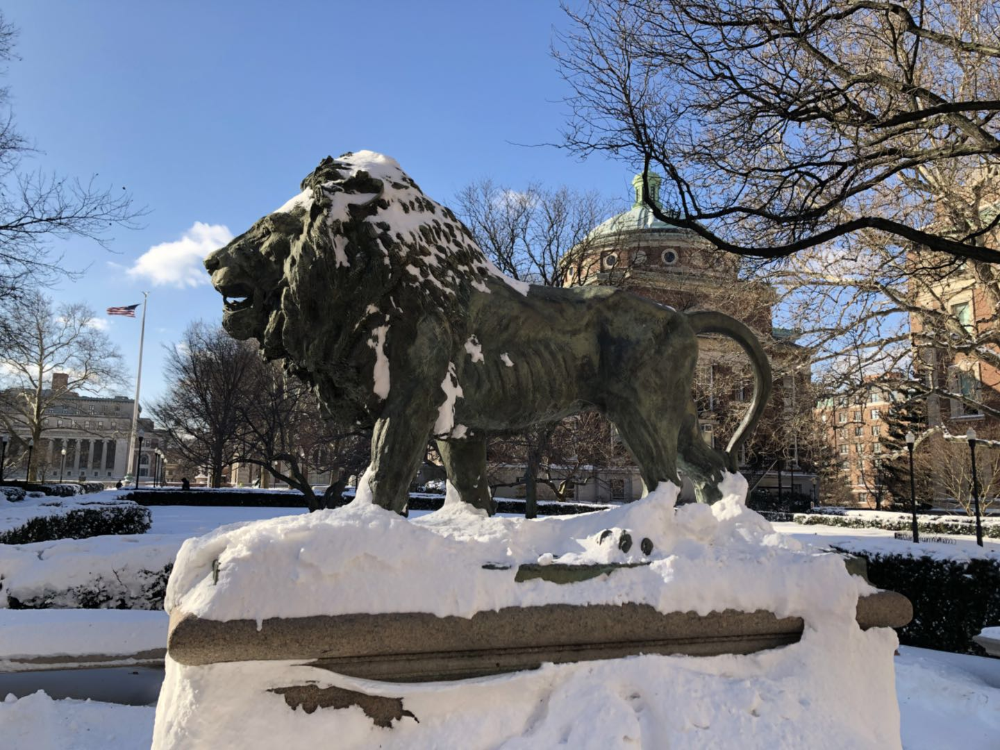
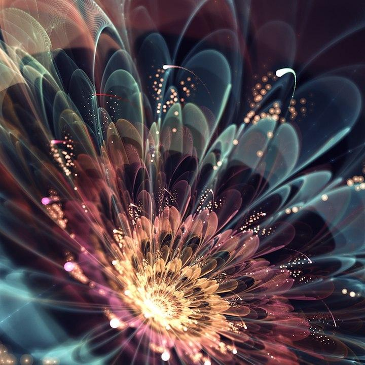
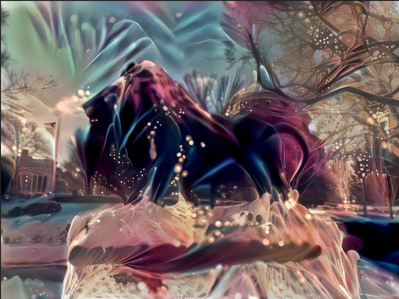
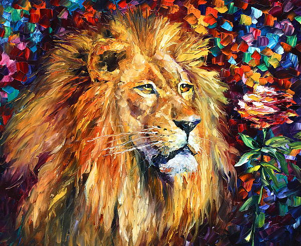
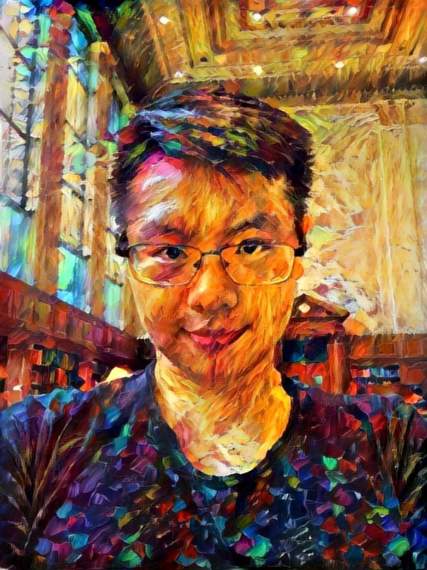

# Neural-style-by-transfer-learning

### See what is image transformation [here](https://www.anishathalye.com/2015/12/19/an-ai-that-can-mimic-any-artist/)

Neural style is really a interesting project to play with, while it take a long time to train the deep learning model.Thanks to Justin Johnson, Alexandre Alahi, and Li Fei-Fei, their paper about Real-Time Style Transfer provide a transfer learning way to do image transformation problems much more quicker.

In this project, I'll implement the [paper](https://arxiv.org/pdf/1603.08155.pdf%7C) 's idea by using TensorFlow package in Python, which is really nice API for machine learning technique.

# Reference：
[Perceptual Losses for Real-Time Style Transfer and Super-Resolution](https://arxiv.org/pdf/1603.08155.pdf%7C)

[A Neural Algorithm of Artistic Style](https://arxiv.org/abs/1508.06576)

# Examples:

###
  

  
